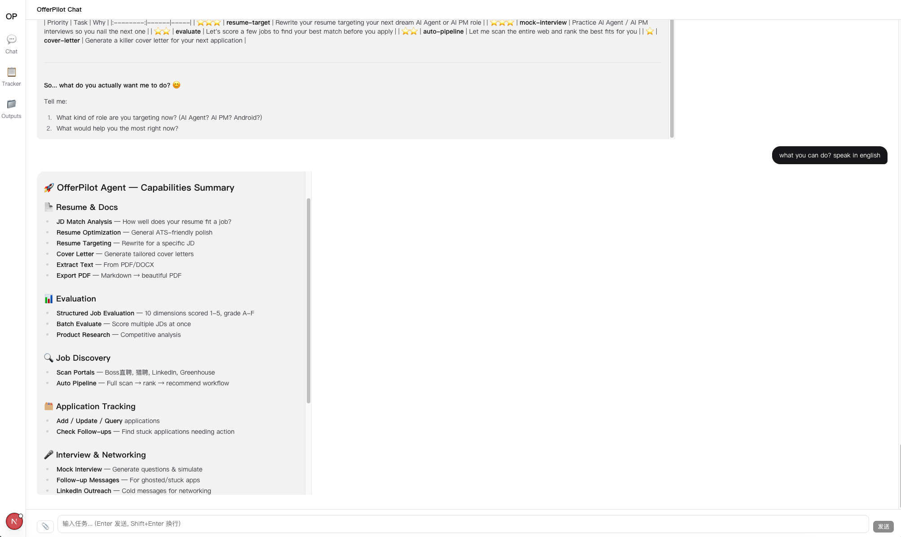

# OfferPilot AI

[](https://python.org)
[](https://langchain-ai.github.io/langgraph/)
[](https://playwright.dev)
[](./LICENSE)

OfferPilot is a local-first AI career assistant for resume rewriting, JD evaluation, targeted applications, job discovery, application tracking, and interview preparation.

Its core rule is simple: **use the candidate's real experience only. No invented projects, fake metrics, or made-up contact details.**

[中文](./README.md)



## Branch Role

This is the `offerpilot-agent` branch. It is the runnable product branch and includes:

- **Agent CLI**: the main interface. Ask in natural language and the LangGraph agent routes the task.
- **Web UI**: a local chat, tracker, and outputs dashboard.
- **Skill Pack**: a portable rule layer for Cursor, Claude Code, Codex, and similar coding agents.
- **Helper CLI**: the `offerpilot` command for extraction, rendering, validation, scanning, and pipeline scripts.

```text
skill-pack = rule layer / methodology / portable workflow
agent      = skill-pack + runtime + tools + UI
```

If you only want the standalone Skill Pack rule layer, use the [`offerpilot-skill`](https://github.com/kalimosd/OfferPilot/tree/offerpilot-skill) branch. The two branches share rules and scripts, but they have different jobs: the skill branch maintains methodology; the agent branch maintains the runnable experience.

## Capabilities

| Capability | Current implementation |
|---|---|
| Resume diagnosis, resume optimization, targeted rewrite, JD fit, cover letters | General Agent + Skill Pack rules + file/PDF tools |
| Structured evaluation | General Agent follows the 10-dimension scoring rules; batch evaluation has a dedicated flow |
| Batch JD evaluation | Dedicated LangGraph branch with low-temperature per-JD scoring and ranking |
| Job scanning and recommendations | Dedicated LangGraph pipeline branch calling `skill-pack/scripts/run_pipeline.py` |
| Application tracking and follow-up | Agent tools and Web Tracker read/write `data/tracker.tsv` |
| Outreach, mock interview, product research | General Agent workflows guided by Skill Pack documents |
| PDF export | Playwright Chromium renders Markdown to PDF |

Note: the current Agent does not include a general-purpose web search tool. Job scanning uses the included scripts; product research tasks should be given source material, or run through the Skill Pack in an external agent that has browsing/search capability.

## Requirements

- Python 3.10+
- Node.js 18+ for the Web UI
- At least one LLM API key, such as DeepSeek, Claude, Gemini, or OpenAI
- Playwright Chromium for PDF rendering and some browser-based scanning paths

## Installation

```bash
git clone -b offerpilot-agent https://github.com/kalimosd/OfferPilot.git offerpilot-ai
cd offerpilot-ai

python -m venv .venv
source .venv/bin/activate

pip install -e ".[dev]"
python -m playwright install chromium
```

If you only want the Agent without tests, `pip install -e .` is enough.

## LLM Configuration

Create a local `.env` file in the repository root:

```bash
touch .env
```

Then choose one provider.

| Variable | Description |
|---|---|
| `OFFERPILOT_MODEL` | Model name. Defaults to `deepseek-chat` |
| `OFFERPILOT_API_KEY` | API key for OpenAI-compatible providers such as DeepSeek |
| `OFFERPILOT_BASE_URL` | Base URL for OpenAI-compatible providers |
| `OFFERPILOT_TEMPERATURE` | Optional override for the default temperature |
| `ANTHROPIC_API_KEY` | Native Claude provider key |
| `GOOGLE_API_KEY` | Native Gemini provider key |
| `OPENAI_API_KEY` | Native OpenAI provider key |

### DeepSeek

```bash
OFFERPILOT_MODEL=deepseek-chat
OFFERPILOT_API_KEY=your-deepseek-key
OFFERPILOT_BASE_URL=https://api.deepseek.com
```

### Claude

```bash
OFFERPILOT_MODEL=claude-sonnet-4-20250514
ANTHROPIC_API_KEY=your-anthropic-key
```

### Gemini

```bash
OFFERPILOT_MODEL=gemini-2.0-flash
GOOGLE_API_KEY=your-google-key
```

### OpenAI

```bash
OFFERPILOT_MODEL=gpt-4o-mini
OPENAI_API_KEY=your-openai-key
```

The current runtime explicitly uses two temperatures: `0.3` for general Agent work and `0.1` for batch JD evaluation. `CREATIVE_TEMPERATURE = 0.7` exists as a helper constant, but the graph does not automatically switch to it by task type yet.

## Prepare Your Data

Create a personal profile store:

```bash
cp skill-pack/templates/profile_store.yaml profile_store.yaml
```

`profile_store.yaml` is not the final resume. It is your fact database.

Main fields:

| Field | Description |
|---|---|
| `meta` | Name, English name, birth year, email, phone, update date |
| `experience` | Work experience with multiple bullets per role |
| `projects` | Side projects, open-source, competitions, school projects |
| `skills` | Skills, level, years, and evidence |
| `education` | Education background |
| `certifications` | Certifications |
| `achievements` | Awards or recognition |

Put job descriptions under `jds/`:

```bash
mkdir -p jds outputs/resumes outputs/pipeline outputs/interview outputs/research outputs/misc
```

Private local files such as `profile_store.yaml`, `jds/`, `outputs/`, and `data/` are intended to stay out of git.

## Run The Agent

Single-shot mode:

```bash
python -m offerpilot.agent "analyze the fit between jds/anthropic-ai-agent-engineer.md and profile_store.yaml"
python -m offerpilot.agent "batch evaluate all JDs in jds/"
python -m offerpilot.agent "run pipeline, scan last 7 days, recommend top 10"
python -m offerpilot.agent "check which applications need follow-up"
```

Interactive mode:

```bash
python -m offerpilot.agent
```

You can also use the installed console script:

```bash
offerpilot-agent "batch evaluate all JDs in jds/"
```

## Helper CLI

`offerpilot-agent` is the natural-language Agent. `offerpilot` is a deterministic helper CLI:

```bash
offerpilot --help
offerpilot extract sample_resume.docx --output sample_resume.txt
offerpilot pdf outputs/resumes/resume.md outputs/resumes/resume.pdf --style standard_cn
offerpilot validate-inputs profile_store.yaml jds/example.md
offerpilot validate-profile profile_store.yaml
offerpilot validate-aliases
offerpilot pipeline --days 7 --top-n 10 --cn-focus
```

`python -m offerpilot` is equivalent to the helper CLI. Use `python -m offerpilot.agent` or `offerpilot-agent` for the natural-language Agent.

## Web UI

Install backend and frontend dependencies:

```bash
source .venv/bin/activate
pip install -r web/api/requirements.txt

cd web/frontend
npm install
cd ../..
```

Start both services:

```bash
./start.sh
```

Open `http://localhost:3000`.

Manual startup:

```bash
# Terminal 1
source .venv/bin/activate
uvicorn web.api.main:app --port 8000

# Terminal 2
cd web/frontend
npm run dev -- --port 3000
```

## API Overview

| Endpoint | Description |
|---|---|
| `GET /api/health` | Health check |
| `POST /api/chat` | Stream Agent messages, tool calls, and tool results over SSE |
| `POST /api/files/upload` | Upload a file to the project root or `jds/` |
| `GET /api/files/outputs` | List `outputs/` or one output subdirectory |
| `GET /api/files/outputs/{subdir}/{filename}` | Download or preview an output file |
| `DELETE /api/files/outputs/{subdir}/{filename}` | Delete an output file |
| `GET /api/tracker` | Query application tracker rows |
| `POST /api/tracker` | Add an application tracker row |
| `PATCH /api/tracker` | Update application status |
| `PUT /api/tracker` | Edit a tracker row |
| `GET /api/tracker/followups` | Find applications that need follow-up |

These APIs are intended for the local Web UI. CORS allows `http://localhost:3000` by default.

## Pipeline Workflow

The pipeline is for job discovery and recommendation:

1. Scan configured job portals.
2. Load recent entries from `data/scan-history.tsv`.
3. Score jobs using portal config, profile tags, and bilingual skill aliases.
4. Deduplicate and rank candidates.
5. Write a Markdown report to `outputs/pipeline/pipeline_recommendations.md`.

Example:

```bash
python -m offerpilot.agent "run pipeline, scan last 14 days, recommend top 20 China-focused roles"
```

## Skill Pack Mode

Use `skill-pack/` when you want a portable workflow for an AI coding agent rather than the built-in OfferPilot agent.

Recommended reading order:

1. `skill-pack/WORKFLOW.md`
2. `skill-pack/INPUTS.md`
3. `skill-pack/RESUME_DIAGNOSIS.md` for resume diagnosis
4. `skill-pack/JD_MATCHING.md` for China-first JD matching
5. `skill-pack/EVALUATION.md` for structured scoring
6. `skill-pack/MOCK_INTERVIEW.md` for mock interviews
7. `skill-pack/PRODUCT_RESEARCH.md` for product research
8. `skill-pack/TRACKER.md` for application tracking
9. `skill-pack/OUTREACH.md` for outreach messages
10. `skill-pack/scripts/README.md` when local helpers are needed
11. `skill-pack/adapters/` for Cursor, Claude Code, or Codex wrappers

Useful helper scripts:

```bash
python skill-pack/scripts/validate_inputs.py profile_store.yaml jds/example.md
python skill-pack/scripts/extract_text.py resume.pdf
python skill-pack/scripts/render_pdf.py outputs/resumes/resume.md outputs/resumes/resume.pdf
python skill-pack/scripts/validate_outputs.py outputs/resumes/resume.md
python skill-pack/scripts/validate_profile_store.py profile_store.yaml
python skill-pack/scripts/validate_aliases.py skill-pack/data/skill_aliases.zh-en.json
```

The Agent also exposes these validation helpers as tools.

## Output Directories

| Directory | Content |
|---|---|
| `outputs/resumes/` | Resume diagnosis, optimization, targeted rewrites, JD fit, structured evaluation, batch evaluation |
| `outputs/research/` | Product research |
| `outputs/interview/` | Interview question sheets, evaluation reports, preparation notes |
| `outputs/pipeline/` | Job discovery and recommendation reports |
| `outputs/misc/` | Outreach messages, project explanations, other materials |

Do not place final deliverables directly under the `outputs/` root.

## Development

Run tests:

```bash
source .venv/bin/activate
python -m pytest
```

Quick graph compile smoke test:

```bash
python - <<'PY'
from unittest.mock import Mock, patch
from offerpilot.graph import build_graph

with patch("offerpilot.graph.get_llm") as get_llm:
    llm = Mock()
    llm.bind_tools.return_value.invoke.return_value = "ok"
    get_llm.return_value = llm
    print(type(build_graph()).__name__)
PY
```

Expected output:

```text
CompiledStateGraph
```

## Troubleshooting

| Problem | Fix |
|---|---|
| `ModuleNotFoundError: langchain_core` | Run `source .venv/bin/activate`, then `pip install -e ".[dev]"` |
| `pytest` is missing | Install dev dependencies with `pip install -e ".[dev]"` |
| `./start.sh` cannot find `uvicorn` | `start.sh` uses `.venv/bin/uvicorn`; create and install the virtualenv first |
| PDF rendering fails | Run `python -m playwright install chromium` |
| Agent model calls fail | Check the model name, API key, and base URL in `.env` |
| Web UI cannot reach the backend | Confirm API is on `http://localhost:8000` and frontend is on `http://localhost:3000` |
| Product research lacks factual grounding | Provide company/product notes, JD text, web excerpts, or use the Skill Pack in an agent with browsing capability |

## Project Structure

```text
.
├── offerpilot/
│   ├── agent.py            # Natural-language Agent CLI
│   ├── cli.py              # Helper CLI
│   ├── graph.py            # LangGraph routing and workflows
│   ├── intent.py           # Intent classification
│   ├── llm.py              # Multi-provider LLM initialization
│   ├── script_loader.py    # skill-pack script loader
│   ├── state.py            # Graph state
│   └── tools.py            # Agent tools
├── skill-pack/             # Workflow docs, adapters, scripts, schemas, data
├── web/
│   ├── api/                # FastAPI backend
│   └── frontend/           # Next.js frontend
├── tests/                  # Unit and integration tests
├── outputs/                # Generated local outputs, ignored by git
├── jds/                    # Local job descriptions, ignored by git
├── data/                   # Tracker and scan history, ignored by git
└── profile_store.yaml      # Local personal profile store, ignored by git
```

## Branch Maintenance

- Rules, prompts, output formats, schemas, templates, scripts, and adapters should generally start in `offerpilot-skill`.
- LangGraph runtime, Agent tools, Web API, frontend work, and runnable UX belong in `offerpilot-agent`.
- After syncing from the skill branch, check `docs/AGENT_SYNC_CHECKLIST.md` to decide whether `offerpilot/graph.py` `SYSTEM_PROMPT` needs updates.
- `docs/migration.md` is historical migration context, not the current shape of this agent branch.

## License

MIT
